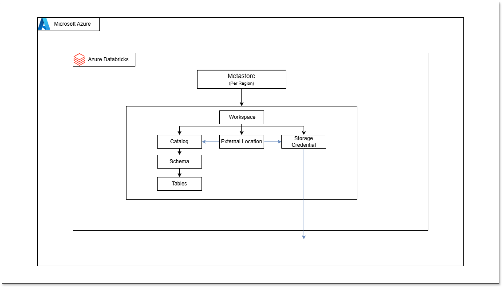

# Azure Data Platform 

A repository for automating **Azure** and **Databricks** deployments with **Terraform**.

---

## Table of Contents

- [Pre-requisites](#pre-requisites)
- [Deployment Steps](#deployment-steps)
- [Diagrams](#diagrams)
- [Project Structure](#project-structure)

---

## Pre-requisites

- Create Azure management group
- Set Subscriptions
- Azure CLI - https://learn.microsoft.com/en-us/cli/azure/install-azure-cli
- Databricks CLI - https://docs.databricks.com/en/dev-tools/cli/install.html
- Terraform - https://developer.hashicorp.com/terraform/install

## Deployment Steps

1. Initial Deployment
   - `terraform init`
   - `terraform plan`
   - `terraform apply` to deploy the initial infrastructure
2. Databricks Configuration
   - After the Databricks workspace is created, navigate to the workspace in the Azure portal
   - Generate a personal access token (User Settings → Developer → New Token)
   - Configure the Databricks CLI:
     ```bash
     databricks configure --token
     ```
   - Enter the workspace URL and access token when prompted
   - This creates a `~/.databrickscfg` file that enables authentication and resource creation
3. Final Deployment
   - Run `terraform apply` again to complete the deployment of resources

---

## Diagrams

### Azure Architecture


### Databricks Architecture



> **Note:** The diagrams are a **high level overview** and don't capture the **all deployed resources**.

---

## Project Structure

```
/azure-terraform
├── /environments                 # Environment configurations
│   └── backend_dev.hcl           # Backend configuration for dev environment
├── /modules
│   ├── /compute                  # Module for compute related resources
│   │   ├── main.tf
│   │   ├── variables.tf
│   │   └── outputs.tf
│   ├── /storage                  # Module for storage related resources
│   │   ├── main.tf
│   │   ├── variables.tf
│   │   └── outputs.tf
│   ├── /databricks_workspace     # Module for Databricks workspace with VNET injection
│   │   ├── main.tf               # Workspace, subnets, NSGs, and NAT gateway
│   │   ├── variables.tf
│   │   └── outputs.tf
│   ├── /security                 # Module for security related resources
│   │   ├── main.tf               # Service principals, Key vault, security groups, etc
│   │   ├── variables.tf
│   │   └── outputs.tf
│   ├── /inactive_resources       # Module for resources currently not in use
│   │   ├── main.tf
│   ├── /monitoring               # Module for monitoring and logging resources
│   │   ├── main.tf
│   │   ├── variables.tf
│   │   └── outputs.tf
│   ├── /network                  # Module for networking components
│   │   ├── main.tf               # VNets, public/private subnets, NSGs, etc
│   │   ├── variables.tf
│   │   └── outputs.tf
│   └── /unity_catalog            # Module for databricks workspace resources
│       ├── main.tf               # Catalogs, schemas, and external locations
│       ├── variables.tf
│       └── outputs.tf
├── module_blocks.tf              # Core configuration to orchestrate modules
├── provider.tf                   # Azure and Databricks providers
├── variables.tf                  # Variables for the project
├── variables.auto.tfvars         # Default values for variables
├── management_resources.tf       # For resources that apply to all modules
├── outputs.tf                    # Root module outputs
└── README.md                     # Project documentation

```
