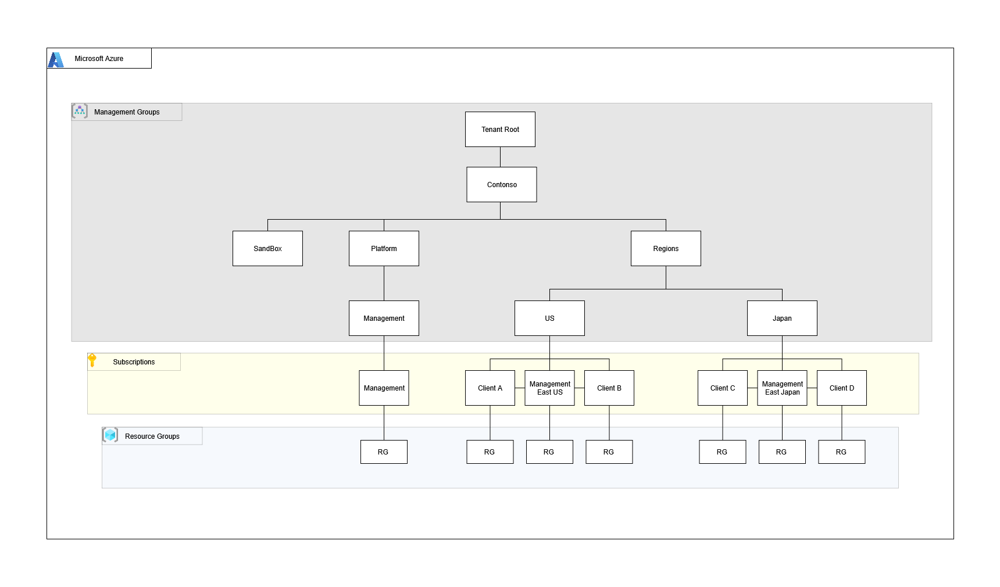

# Azure Data Platform 

A repository for automating **Azure** and **Databricks** deployments with **Terraform**.

---

## Table of Contents

- [Pre-requisites](#pre-requisites)
- [Deployment Steps](#deployment-steps)
- [Diagrams](#diagrams)
- [Project Structure](#project-structure)
- [Resources Documentation](#resources-documentation)

---

## Pre-requisites

- Create Azure management group
- Set Subscriptions
- Azure CLI - https://learn.microsoft.com/en-us/cli/azure/install-azure-cli
- Databricks CLI - https://docs.databricks.com/en/dev-tools/cli/install.html
- Terraform - https://developer.hashicorp.com/terraform/install

## Deployment Steps

1. Initial Deployment
   - `chmod +x ./.debug.prod.sh`
   - `./.debug.prod.sh plan`
   - `./.debug.prod.sh apply` to deploy the initial infrastructure
2. Databricks Configuration
   - After the Databricks workspace is created, navigate to the workspace in the Azure portal
   - Generate a personal access token (User Settings → Developer → New Token)
   - Configure the Databricks CLI:
     ```bash
     databricks configure --token
     ```
   - Enter the workspace URL and access token when prompted
   - This creates a `~/.databrickscfg` file that enables authentication and resource creation
3. Final Deployment
   - Run `./.debug.prod.sh apply` again to complete the deployment of resources

---

## Diagrams

### Azure organization



### Azure data lake and Databricks


### Databricks Architecture


> **Note:** The diagrams are a **high level overview** and don't capture the **all deployed resources**.

---

## Project Structure

```
/azure-terraform
├── /env                          # Environment configurations
│   └── prod.tfvars
│               
├── /modules
│   ├── /compute                  # Module for compute related resources
│   │   ├── main.tf
│   │   ├── variables.tf
│   │   └── outputs.tf
│   ├── /storage                  # Module for storage related resources
│   │   ├── main.tf
│   │   ├── variables.tf
│   │   └── outputs.tf
│   ├── /dbx_workspace            # Module for Databricks workspace with VNET injection
│   │   ├── main.tf               # Workspace, subnets, NSGs, and NAT gateway
│   │   ├── variables.tf
│   │   └── outputs.tf
│   ├── /security                 # Module for security related resources
│   │   ├── main.tf               # Service principals, Key vault, security groups, etc
│   │   ├── variables.tf
│   │   └── outputs.tf
│   ├── /inactive_resources       # Module for resources currently not in use
│   │   ├── main.tf
│   ├── /monitoring               # Module for monitoring and logging resources
│   │   ├── main.tf
│   │   ├── variables.tf
│   │   └── outputs.tf
│   ├── /network                  # Module for networking components
│   │   ├── main.tf               # VNets, public/private subnets, NSGs, etc
│   │   ├── variables.tf
│   │   └── outputs.tf
│   └── /unity_catalog            # Module for databricks workspace resources
│       ├── main.tf               # Catalogs, schemas, and external locations
│       ├── variables.tf
│       └── outputs.tf
│
├── /regions
│   ├── /us
│   │   ├── /management
│   │   │   ├── /env
│   │   │   │   └── prod.tfvars
│   │   │   ├── .debug.prod.sh
│   │   │   ├── main.tf
│   │   │   ├── variables.tf
│   │   │   └── outputs.tf
│   │   └── /clients
│   │       ├── /client-a
│   │       │   ├── /env
│   │       │   │   └── prod.tfvars
│   │       │   ├── .debug.prod.sh
│   │       │   ├── main.tf
│   │       │   ├── variables.tf
│   │       │   └── outputs.tf
│   │       └── /client-b
│   │           ├── /env
│   │           │   └── prod.tfvars
│   │           ├── .debug.prod.sh
│   │           ├── main.tf
│   │           ├── variables.tf
│   │           └── outputs.tf
│   │
│   └── /japan
│       ├── /management
│       │   ├── /env
│       │   │   └── prod.tfvars
│       │   ├── .debug.prod.sh
│       │   ├── main.tf
│       │   ├── variables.tf
│       │   └── outputs.tf
│       └── /clients
│           └── /client-c
│               ├── /env
│               │   └── prod.tfvars
│               ├── .debug.prod.sh
│               ├── main.tf
│               ├── variables.tf
│               └── outputs.tf
├── .debug.prod.sh                # Sets the backend and some environment variables
├── iam.tf                        # Creates security groups
├── main.tf                       # Core configuration to orchestrate modules
├── versions.tf                   # Azure and Databricks providers
├── variables.tf                  # Variables for the project
├── management_groups.tf          # Sets management group hierarchy
├── outputs.tf                    # Root module outputs
└── README.md                     # Project documentation
└── template.tf                   # Templates for tfvars and debug.sh files

```
---
## Resources Documentation
Detailed documentation for all deployed resources is available in the individual module directories

## Modules

| Name | Source | Version |
|------|--------|---------|
| <a name="module_compute"></a> [compute](#module\_compute) | ./modules/compute | n/a |
| <a name="module_dbx_workspace"></a> [dbx\_workspace](#module\_dbx\_workspace) | ./modules/dbx_workspace | n/a |
| <a name="module_monitoring"></a> [monitoring](#module\_monitoring) | ./modules/monitoring | n/a |
| <a name="module_network"></a> [network](#module\_network) | ./modules/network | n/a |
| <a name="module_security"></a> [security](#module\_security) | ./modules/security | n/a |
| <a name="module_storage"></a> [storage](#module\_storage) | ./modules/storage | n/a |
| <a name="module_unity_catalog"></a> [unity\_catalog](#module\_unity\_catalog) | ./modules/unity_catalog | n/a |

## Resources

| Name | Description | Type |
|------|-------------|------|
| [azuread_group.External_Users](https://registry.terraform.io/providers/hashicorp/azuread/latest/docs/resources/group) | Creates Azure Entra ID group for external users | resource |
| [azuread_group.data_engineers](https://registry.terraform.io/providers/hashicorp/azuread/latest/docs/resources/group) | Creates Azure Entra ID group for data engineers | resource |
| [azurerm_management_group.Management](https://registry.terraform.io/providers/hashicorp/azurerm/latest/docs/resources/management_group) | Creates management group under the platform management group for the log analytics workspace | resource |
| [azurerm_management_group.Platform](https://registry.terraform.io/providers/hashicorp/azurerm/latest/docs/resources/management_group) | Creates the parent management group for the management group | resource |
| [azurerm_management_group.Sandbox](https://registry.terraform.io/providers/hashicorp/azurerm/latest/docs/resources/management_group) | Creates management group for the sandbox environment | resource |
| [azurerm_management_group.countries](https://registry.terraform.io/providers/hashicorp/azurerm/latest/docs/resources/management_group) | Creates management group for country based organization | resource |
| [azurerm_management_group.organization](https://registry.terraform.io/providers/hashicorp/azurerm/latest/docs/resources/management_group) | Creates management group for the organization under the root management group | resource |
| [azurerm_management_group.regions](https://registry.terraform.io/providers/hashicorp/azurerm/latest/docs/resources/management_group) | Creates the parent management group for the countries management group | resource |
| [azurerm_resource_group.main](https://registry.terraform.io/providers/hashicorp/azurerm/latest/docs/resources/resource_group) | Creates main resource group for the majority of resources | resource |
| [azurerm_client_config.current](https://registry.terraform.io/providers/hashicorp/azurerm/latest/docs/data-sources/client_config) | Retrieves metadata for the current Azure client, including tenant ID, client ID, and object ID | data source |

## Inputs

| Name | Description | Type | Required |
|------|-------------|------|:--------:|
| <a name="input_account_id"></a> [account\_id](#input\_account\_id) | Databricks account ID | `string` | n/a | yes |
| <a name="input_adls_logs"></a> [adls\_logs](#input\_adls\_logs) | List of Data Lake logs to enable | `list(string)` | `[]` | no |
| <a name="input_alert_email"></a> [alert\_email](#input\_alert\_email) | Email used for monitoring alerts | `string` | n/a | yes |
| <a name="input_client"></a> [client](#input\_client) | Client name for resource naming. | `string` | n/a | yes |
| <a name="input_containers"></a> [containers](#input\_containers) | Storage containers for data lake | `list(any)` | n/a | yes |
| <a name="input_countries"></a> [countries](#input\_countries) | Sets the list of countries (Management Groups) | `list(string)` | n/a | yes |
| <a name="input_created_by"></a> [created\_by](#input\_created\_by) | Tag showing Terraform created this resource | `string` | n/a | yes |
| <a name="input_dbx_logs"></a> [dbx\_logs](#input\_dbx\_logs) | List of Databricks logs to enable | `list(string)` | `[]` | no |
| <a name="input_environment"></a> [environment](#input\_environment) | Environment for the resources | `string` | n/a | yes |
| <a name="input_owner"></a> [owner](#input\_owner) | Owner of the project or resources | `string` | n/a | yes |
| <a name="input_project"></a> [project](#input\_project) | Main project associated with this deployment | `string` | n/a | yes |
| <a name="input_region"></a> [region](#input\_region) | Region where resources will be created | `string` | n/a | yes |
| <a name="input_root_management_group_id"></a> [root\_management\_group\_id](#input\_root\_management\_group\_id) | The ID of the Root Management Group | `string` | n/a | yes |
| <a name="input_schemas"></a> [schemas](#input\_schemas) | Schema names for dbx catalog | `list(any)` | n/a | yes |
| <a name="input_subnet_address_prefixes"></a> [subnet\_address\_prefixes](#input\_subnet\_address\_prefixes) | A map of address prefixes for each subnet | `map(string)` | n/a | yes |
| <a name="input_trusted_ip_ranges"></a> [trusted\_ip\_ranges](#input\_trusted\_ip\_ranges) | List of trusted IP ranges for access to public VMs | `list(string)` | n/a | yes |
| <a name="input_username"></a> [username](#input\_username) | Username for accounts | `string` | n/a | yes |
| <a name="input_vm_private_ip"></a> [vm\_private\_ip](#input\_vm\_private\_ip) | Static private IP address for the VM | `string` | n/a | yes |
| <a name="input_vnet_address_space"></a> [vnet\_address\_space](#input\_vnet\_address\_space) | The address space for the virtual network | `list(string)` | n/a | yes |

## Outputs

| Name | Description |
|------|-------------|
| <a name="output_resource_group_id"></a> [resource\_group\_id](#output\_resource\_group\_id) | main resource group where most resources will be placed |
| <a name="output_resource_group_name"></a> [resource\_group\_name](#output\_resource\_group\_name) | name of main resource group where most resources will be placed |